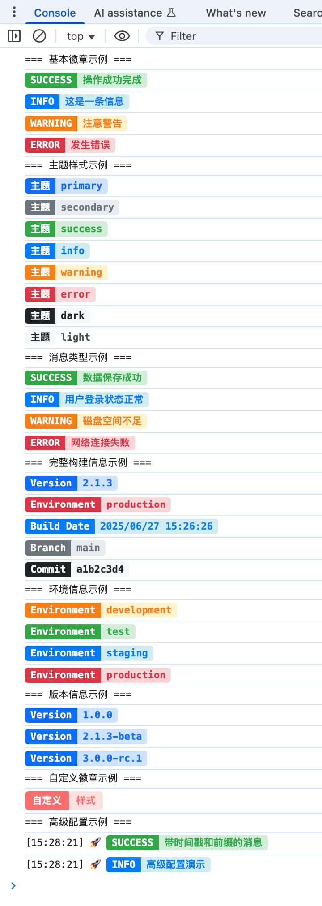

# 🎨 Console Charm

一个用于在控制台输出带样式信息的TypeScript库，支持多种模块格式（ESM、CJS、UMD、AMD）和美观的预设主题。

[🚀 在线演示](https://zhiyingzzhou.github.io/console-charm/examples/basic.html)

[📸 查看使用示例](#示例图片)

## ✨ 特性

- 🎯 **多种输出格式**: 支持成功、信息、警告、错误等消息类型
- 🎨 **美观的预设主题**: 8种精心设计的配色方案
- 🛠 **完全自定义**: 支持自定义标签、值、颜色和样式
- 📦 **多模块格式**: 支持 ESM、CJS、UMD、AMD 等格式
- 🌍 **跨平台兼容**: 支持浏览器和 Node.js 环境
- 🔧 **TypeScript支持**: 完整的类型定义
- 📊 **构建信息输出**: 轻松输出版本、环境、构建时间等信息
- ⚙️ **灵活配置**: 支持时间戳、前缀、禁用等配置选项

## 📦 安装

```bash
npm install console-charm
```

```bash
yarn add console-charm
```

```bash
pnpm add console-charm
```

## 🚀 快速开始

### 基本使用

```javascript
import { success, info, warning, error } from 'console-charm';

success('操作成功完成');
info('这是一条提示信息');
warning('请注意这个警告');
error('发生了一个错误');
```

### 使用预设主题

```javascript
import { badgeWithTheme } from 'console-charm';

badgeWithTheme('状态', 'primary', 'primary');
badgeWithTheme('级别', 'VIP', 'warning');
badgeWithTheme('环境', 'production', 'error');
```

### 输出构建信息

```javascript
import { buildInfo, version, environment } from 'console-charm';

// 单独输出
version('1.2.3');
environment('production');

// 批量输出构建信息
buildInfo({
  version: '1.2.3',
  environment: 'production',
  buildDate: new Date(),
  branch: 'main',
  commit: 'a1b2c3d4e5f6'
});
```

## 🎨 预设主题

库提供了8种美观的预设主题：

| 主题        | 描述     | 适用场景           |
| ----------- | -------- | ------------------ |
| `success`   | 绿色系   | 成功状态、完成操作 |
| `info`      | 蓝色系   | 信息提示、一般状态 |
| `warning`   | 橙色系   | 警告信息、注意事项 |
| `error`     | 红色系   | 错误信息、失败状态 |
| `primary`   | 深蓝色系 | 主要信息、版本号   |
| `secondary` | 灰色系   | 次要信息、分支名   |
| `dark`      | 黑色系   | 深色主题、提交哈希 |
| `light`     | 浅色系   | 浅色主题、一般文本 |

## 📚 API 文档

### 便捷方法

```javascript
import { success, info, warning, error } from 'console-charm';

success('成功消息'); // 绿色成功主题
info('信息消息'); // 蓝色信息主题
warning('警告消息'); // 橙色警告主题
error('错误消息'); // 红色错误主题
```

### 主题方法

```javascript
import { badgeWithTheme } from 'console-charm';

badgeWithTheme('标签', '值', '主题名称');
```

### 构建信息方法

```javascript
import { version, environment, buildDate, branch, commit, buildInfo } from 'console-charm';

version('1.0.0'); // 版本号
environment('production'); // 环境
buildDate(new Date()); // 构建时间
branch('main'); // Git分支
commit('abc123def456'); // Git提交（自动截取前8位）

// 批量输出
buildInfo({
  version: '1.0.0',
  environment: 'production',
  buildDate: new Date(),
  branch: 'main',
  commit: 'abc123def456'
});
```

### 自定义徽章

```javascript
import { badge } from 'console-charm';

badge({
  label: '自定义标签',
  value: '自定义值',
  labelStyle: {
    color: '#ffffff',
    backgroundColor: '#ff6b6b',
    fontWeight: 'bold',
    padding: '4px 8px',
    borderRadius: '4px 0 0 4px'
  },
  valueStyle: {
    color: '#ff6b6b',
    backgroundColor: '#ffe0e0',
    fontWeight: 'bold',
    padding: '4px 8px',
    borderRadius: '0 4px 4px 0'
  }
});
```

### 高级配置

```javascript
import { createConsoleCharm, updateDefaultConfig } from 'console-charm';

// 创建自定义实例
const charm = createConsoleCharm({
  showTimestamp: true, // 显示时间戳
  prefix: '🚀 MyApp', // 自定义前缀
  disabled: false, // 是否禁用
  disableInProduction: true // 生产环境禁用
});

charm.success('带配置的消息');

// 更新默认配置
updateDefaultConfig({
  showTimestamp: true,
  prefix: '📦'
});
```

## 🔧 类实例使用

```javascript
import { ConsoleCharm } from 'console-charm';

const charm = new ConsoleCharm({
  showTimestamp: true,
  prefix: '🔥 App'
});

charm.success('实例方法调用');
charm.badgeWithTheme('状态', '运行中', 'success');
```

## 🌐 不同环境使用

### ES模块 (推荐)

```javascript
import { success, buildInfo } from 'console-charm';

success('ES模块导入');
```

### CommonJS

```javascript
const { success, buildInfo } = require('console-charm');

success('CommonJS导入');
```

### UMD (浏览器)

```html
<script src="./node_modules/console-charm/dist/umd/index.js"></script>
<script>
  ConsoleCharm.success('UMD全局使用');
  ConsoleCharm.buildInfo({
    version: '1.0.0',
    environment: 'browser'
  });
</script>
```

### AMD

```javascript
define(['console-charm'], function (ConsoleCharm) {
  ConsoleCharm.success('AMD模块使用');
});
```

## 🎯 实际应用示例

### 应用启动日志

```javascript
import { success, info, environment, version, buildDate } from 'console-charm';

console.log('🚀 应用启动中...\n');

environment(process.env.NODE_ENV || 'development');
version(process.env.npm_package_version || '1.0.0');
buildDate(new Date());

success('✅ 应用启动成功');
info('📝 日志系统已初始化');
info('🔌 数据库连接正常');
success('🎉 所有服务就绪');
```

### 构建脚本输出

```javascript
import { buildInfo, success, info } from 'console-charm';

info('📦 开始构建...');

buildInfo({
  version: process.env.npm_package_version,
  environment: 'production',
  buildDate: new Date(),
  branch: process.env.GIT_BRANCH,
  commit: process.env.GIT_COMMIT
});

success('✅ 构建完成');
```

### 错误监控

```javascript
import { error, warning, info } from 'console-charm';

try {
  // 业务逻辑
} catch (err) {
  error(`❌ 操作失败: ${err.message}`);
}

// 性能警告
if (responseTime > 1000) {
  warning(`⚠️ 响应时间过长: ${responseTime}ms`);
}

info('📊 请求处理完成');
```

## ⚙️ 配置选项

| 选项                  | 类型      | 默认值      | 描述             |
| --------------------- | --------- | ----------- | ---------------- |
| `disabled`            | `boolean` | `false`     | 是否禁用所有输出 |
| `showTimestamp`       | `boolean` | `false`     | 是否显示时间戳   |
| `prefix`              | `string`  | `undefined` | 自定义前缀       |
| `disableInProduction` | `boolean` | `false`     | 生产环境自动禁用 |

## 🎨 样式选项

| 属性              | 类型                 | 描述     |
| ----------------- | -------------------- | -------- |
| `color`           | `string`             | 文本颜色 |
| `backgroundColor` | `string`             | 背景颜色 |
| `fontWeight`      | `'normal' \| 'bold'` | 字体粗细 |
| `fontSize`        | `string`             | 字体大小 |
| `padding`         | `string`             | 内边距   |
| `borderRadius`    | `string`             | 边框圆角 |

## 🔍 环境检测

```javascript
import { detectEnvironment } from 'console-charm';

const env = detectEnvironment();
console.log('环境信息:', env);
// {
//   isBrowser: false,
//   isNode: true,
//   supportsStyles: true,
//   nodeVersion: '18.17.0'
// }
```

## 📝 开发

### 克隆项目

```bash
git clone https://github.com/yourusername/console-charm.git
cd console-charm
```

### 安装依赖

```bash
npm install
```

### 开发命令

```bash
npm run dev        # 开发模式（监听文件变化，自动重新构建）
npm run build      # 构建所有格式（ESM、CJS、UMD、AMD + 类型定义）
npm run build:watch # 监听模式构建
npm run test       # 运行测试
npm run lint       # 代码检查
npm run format     # 代码格式化
```

### 测试示例

```bash
# 构建项目
npm run build

# 运行 Node.js 示例
node examples/node.js

# 打开浏览器示例
# 在浏览器中打开 examples/basic.html
```

## 📄 许可证

MIT © zhiyingzhou

## 🤝 贡献

欢迎提交 Issue 和 Pull Request！

1. Fork 项目
2. 创建特性分支 (`git checkout -b feature/AmazingFeature`)
3. 提交更改 (`git commit -m 'Add some AmazingFeature'`)
4. 推送到分支 (`git push origin feature/AmazingFeature`)
5. 打开 Pull Request

## 📞 支持

如果你觉得这个项目有用，请给它一个 ⭐️！

如有问题，请[提交 Issue](https://github.com/yourusername/console-charm/issues)。

## 示例图片


